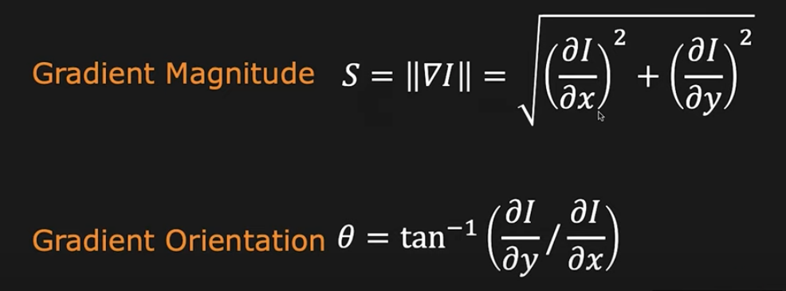

# First Principles of Computer Vison - Detection

## 1 Edge Detection

### 1.1 What is an Edge?

#### 1.1.1 What is an Edge?

Loosely speaking, we can say that an edge is a rapid change in image intensity within a small window in the image.

Here's an example from V.Nalwa's book. On the left, you see a photograph of a sculpture by Henry Moore --- a famous sculpture, on the right, you see a sketch of the sculpture, which is made by an artist.

You can see on the right that just with a few strokes, the artist is able to convey a lot of information about the sculpture --- the 3D structure of the sculpture, some of the lighting effects like shading and highligts, and so on.

So this is just to convey the point that edges, where you have rapid changes in brightness are extremely important in terms of conveying or capturing visual information.

#### 1.1.2 Causes of Edges

What are the physical phenomena in the real world that end up causing edges in images?

How do these edges actually manifect in terms of intensity profiles in the image?

#### 1.1.3 Types of Edges

For our purposes, we have to pin down a model for the edge so that we can use this to then develop a theroy of edge detection. So we are going to take the simplest of these models and use the step function shown here --- the step edge.

Now, it would be nice if edges appeared in images like this very clean step function shown here -- that would make the problem of edge detection a lot easier.

#### 1.1.4 Real Edges

Unfortunately for us, they tend to look like this, because images are noisy.

And then there's the sampling that take place in the image, there's also quantization, and other effects. So edges can actually look quite a bit different from the ideal step function, but we need to be able to still robustly detect them.

#### 1.1.5 Edge Detector

**We want an Edge Operator that produces:**

- **Edge Position**
- **Edge Magnitude (Strength)**
- **Edge Oientation (Direction)**

**Performance Requirements:**

- **High Detection Data**
- **Good Localization**
- **Low Noise Sensitivity**

### 1.2 Edge Detection Using Gradients

#### 1.2.1 1D Edge Detection

**Edge is a rapid change in image intensity in a small region.**

**Basic Calculus: Derivative of a continuous function represents the amount of change in the funciton.**

So it makes sense for us to find the first derivative of this function and see how that responds to these edges.

So now, we'd like to apply this idea of using first derivatives to 2D images.

#### 1.2.2 2D Edge Detection

**Basic Calculus: Partial Derivative of a 2D continuous function represents the amount of change along each dimension.**

#### 1.2.3 Gradient ($\nabla$)

Gradient (Partial Derivatives) represents the direction of most rapid change in intensity

From these two numbers at each pixel, you can now find both the strength the magnitude of the edge, as well as the orientation of the edge.

So that's all done in continuous domain, how we might implement it and apply it to discrete image.

#### 1.2.4 Discrete Gradient ($\nabla$) Operator

The derivative are using finite differences when it comes to discrete images.

If you want to find the difference, you need at least two pixels, so you need at least an extent of two pixels in the x direction.

For the y component, you need at least two pixels along the y direction, we we endup using four pixels.

Let's assume for a minute that the distance, the physical distance between the pixels is epsilon ($\varepsilon$), the derivative in the x direction is this.

These are convolution filters where the flips you can imagine that the flips have already been applied.

Even if you don't know the distance between adjacent pixels --- if you don't know epsilon ($\varepsilon$), it doesn't really matter because all you're going to be doing is scalling up all the gradients, all the derivative by the same amount.

So what we're saying here is you convol the image with this, you get another number at each pixel. These two numbers are enough to determine the strength and the orientation of the edge.

#### 1.2.5 Comparing Gradient ($\nabla$) Operator

So using this approach, a variety of gradient operators have been proposed overthe last few decades starting with the Roberts operator...

In this case, I should mention that the derivtives are bing found in the diagonal direction --- just a minor point here --- two orthogonal directions.

From let to right --- these operators are getting larger and larger, so what's going on here? Well, let's take a look at what happens when you go from small to large.

- **Small**
  - Good Localization
    - Because it's such a small operator that it's not going to be ever affected by pixels that are far away from the pixel that you are looking at.
  - Noise Sensitive
    - Because you are essentially using four numbers to determine whether a particular point has an adge. If noise corrupts even one of thoes four numbers, you are sort of in trouble.
  - Poor Detection
- **Large**
  - Pooer Localization
    - Because if you are tring to find an edge at one particular location, but the operator is so large, it might be influenced by things that are happening pretty far away, for instance, in these corners.
    - So as long as the edge actually continues to be an edge over the entire extent of the operator, you are fine. But if the edge then turns into something else and new information appears, then that's going to end up affecting the output of the operator.
    - That is the trade-off.
  - Less Noise Sensitive
  - Good Detection

#### 1.2.6 Gradient ($\nabla$) Using Sobel Filter

#### 1.2.7 Edge Thresholding

There are essentially two ways:

#### 1.2.8 Sobel Edge Detector

## 2 Boundary Detection

## 3 SIFT Detector
