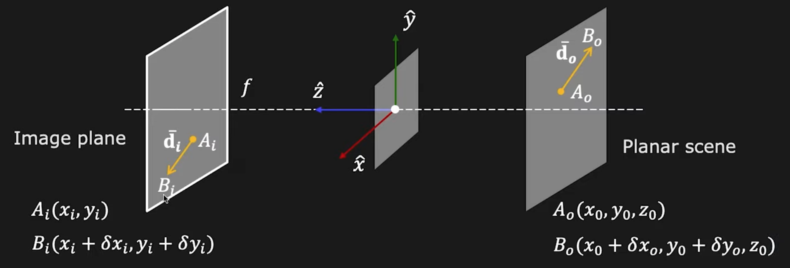
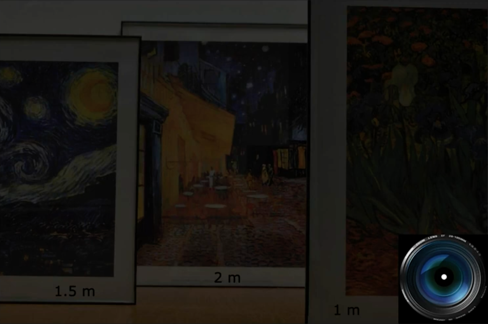
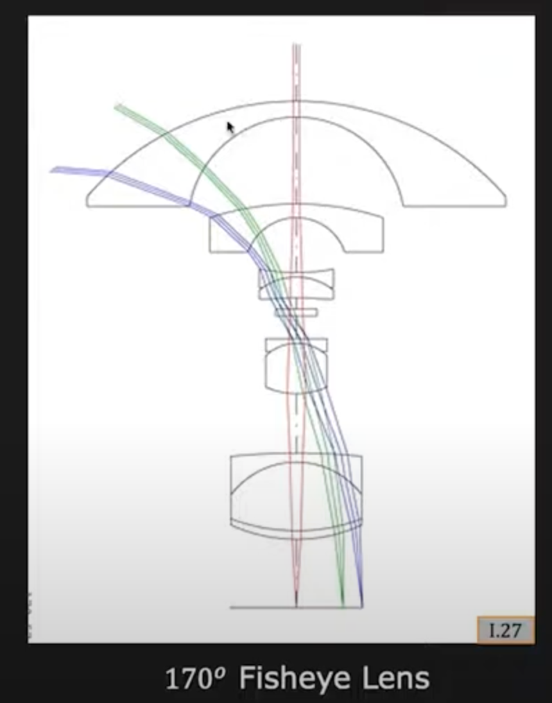
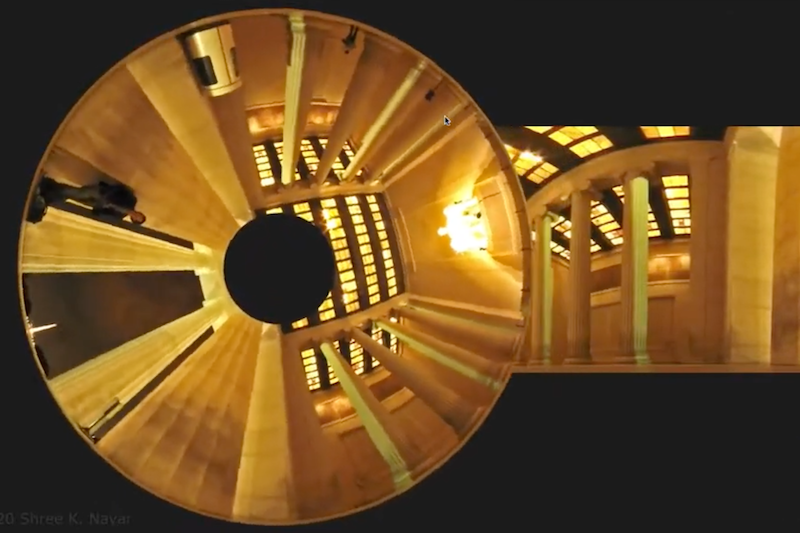
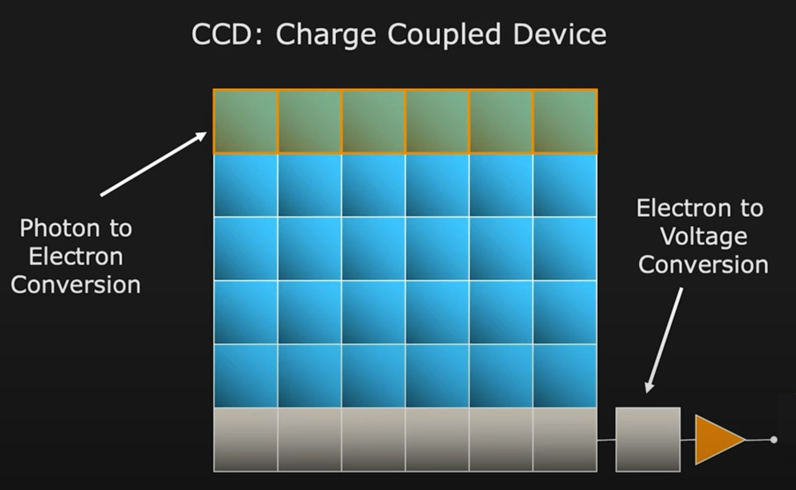
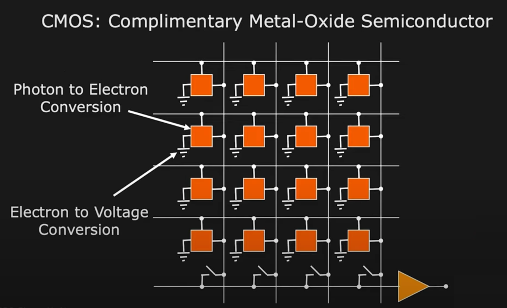
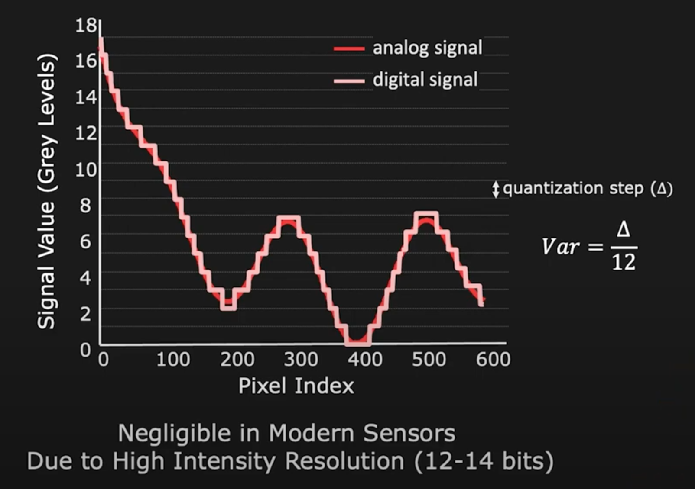
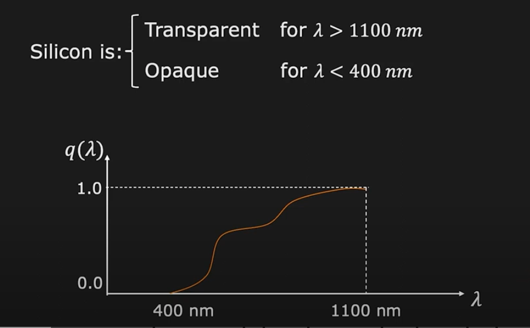
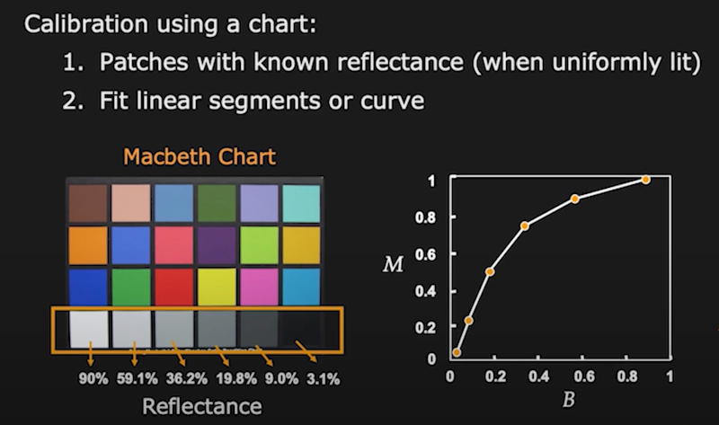
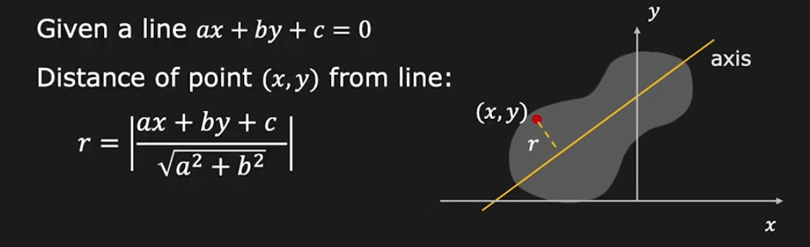

# First Principles of Computer Vison

## 1 Imaging: Image Formation

### 1.1 Image Formation Overview

**Image: Projection of 3D scene onto 2D plane\*. We need to understand the geometric and photometric relation between the scene and its image.**

- By geometric, we mean given a point in the scene. We need to understand where it ends up in the image.
- By photometric, we mean the brightness and appearance of a point in this scene would be in the image.

**Topics:**

- **(1) Pinhole and Perspective Projection**

  - This is the simplest type of camera you can imagine. It has a very long history.

  - The pinhole camera performs what's called **perspective projection**. This is one of the most important concepts in computer vision.

  - We'll derive perspective projection and talk about some of the visual manifestations of perspective projection.

  - And then we'll argue that while the pinhole camera is great in terms of the clarity of images it can produce, it simply does not gather enough ligjt. To resolve this issue, we use lenses.

- **(2) Image Formation using Lenses**

  - Various attributes, focal length, depth of field, defocus, F number.

- **(3) Lens Related Issues**

  - Even if a lens is perfectly manufactured, it turns out that it's going to end up having some geometric aberrations and produce some distortions.

  - We'll talk about what these effects are in images and how we might be able to correct them.

- **(4) Wide Angle Cameras**

  - We will deviating from perspective project, and look at the problem of capturing unusually large fields of view.

  - For example, hemispherical field of view. It turns out this cannot be done using perspective projection.

  - So we design lens, which will allow us to capture very large fields of view, as well as combinations of mirrors and lenses.

- **(5) Biological(Animal) Eyes**
  - Focus on human eye and some of its remarkable characteristics.

### 1.2 Pinhole and Perspective Projection

#### 1.2.1 Is an image being formed on the screen?

Here you see a three-dimensional scene on the right, which is a house. And you see a screen, or let's call it an image plane, on the left.

**Question: Is an image being formed on the screen?**

If you consider any point on the screen, it does receive light from a lot of points on the house. But you don't see a clear image.

So one could arugue that there is an image being formed. But it's a muddled image, and not a clear one.

**Answer: Yes! But not a "clear" one.**

#### 1.2.2 How does one create an image on the screen?

**Question: How does one create a clear, crisp image of the house on the screen?**

The simplest way to do this is by using a pinhole.

A pinhole is an opaque sheet with a tiny hole in it. And it's placed between the scene and the image plane as show here.

Now if you take a look at a single on the house, you see that there is a ingle ray that travels from that point, in this case, $P_{0}$, to the image plane, and projects ontothe point Pi.

So every point of the scene now projects on to a single point in the image.

So we want to understand the relationship between $P_{0}$ and $P_{i}$.

For that, first, we are going to erect a coordinate frame, xyz, three-dimensional coordinate frame placed at the pinhole, with the z-axis pointing along the optical axis.

The optical axis, by the way, is the axis that is perpendicular to the image plane, shown here as a dotted line.

#### 1.2.3 Effective Focal Length

So the z-axis point towrds the image plane and lines on the optical axis. And the distance between the pinhole and the image plane is called the **effective focal length**, that is $f$.

So now we can write the point $P_{0}$ using the vector $\overline{r_{0}}$. And that has coordinates $x_{0}$, $y_{0}$, $z_{0}$.

And its image can be denoted as $r_{i}$, which has coordinates $x_{i}$ and $y_{i}$ on the image plane. And the z-coordicate is going to be $f$.

Inrespective of where the point lies in 3D scene, irrespective of its $z$ component on the image plane is going to be $f$, the **effective focal length**.

From these two similar triangles shown as above, we can write:

By the way, $z_{0}$ is the z-component of the point in 3D. In other words, it's the depth of point in 3D.

And since $\overline{r_{i}}$ and $\overline{r_{0}}$ are vectors, we can break it down into its components into the equations as below.

#### 1.2.4 Pinhole Camera History - Camera Obscura

Very simple equation, but create some fairly non-intuitive effects in images. So this idea of pinhole, projection and a pinhole camera, actually dates back to 500 BC.

There were Chinese philosophers who were riting about this concept way back then. And then somewhere around 1000 AD, the Arab physicist, Alhazen, he wrote a book called <<Kitab al-Manazir>>, it's actually one of the first optics books. He describes, in great deal, this concept of pinhole camera.

And it's only in the 16th century, that this concept actually came to the West. It became very popular among artists, particuarly, as a tool for rendering accurate depictions.

So here is a sketch by Gemma Frisius, the Dutch mathematician, where you can see that there is a wall with a little pinhole, the 3D scene gets projected by this pinhole onto a 2D image.

And now you can imagine that an artist can walk up to this wall and sketch out a very accurate geometrical representation of the perspective projection of the scene, a picture.

By the way, this concept was called **_camera obscura_**, which in Latin, means a dark chamber.

#### 1.2.5 Pinhole Eye of Nautilus pompilius

Well, when it comes to the pinhole camera, as with many other things in life, nature got there first. So here is an eye, which is a pinhole eye, in the case of thi creature. This is a shelled sea creature called Nautilus pompilius(鹦鹉螺).

You can see that it has an eye with a farily large pinhole, which creates an image, and there is no lens in this eye.

#### 1.2.6 Perspective Projection of a Line

All right now let's take a look at some of the properties of perspective projection.

And we know that the line and the pinhole, that is a line and a point, define a plane in 3D. And all the rays of light that pass through the pinhole lie on this plane.

And for that matter, all the rays of light that pass through the pinhole towards the image plane almost should lie on this plane. And so the image of this 3D line on your 2D image must be the intersection, must line at the intersection of this plane and the image plane.

So in other words, the image of a line in 3D, has to be a line in 2D. This is why you find that in photographs, **straght lines in the scene will map to straght lines in the photograph**.

#### 1.2.7 Image Magnification Equation

You have an object of a certain size, at a certain distance, what is going to be its size in the image. So for thi, we're going to use a little segment here: $A_{0}$ -> $B_{0}$ of length $d_{0}$.

So this segment lies on a plane in the scene that is parallel to the image plane. Then it produces an image, which is another segment which is $A_{i}$ -> $B_{i}$.

We want to understand what the length of the segment $A_{i}$ -> $B_{i}$ is going to be due to a segment of length $d_{0}$ in the scene.

So the ratio of the length of the segment in the image to the length of the segment in the scene, is called the magnification. And this, of course, can be written in terms of the displacements:

So now we want to substitute for the displacements in the image. So we can simply this. And to do that, what we're going to do is apply perspective projection to the Point $A_{0}$ and $B_{0}$. In doing so, we are going to get four equations:

**From Perspective Project:**

${x_i \over f} = {x_0 \over z_0}$ and ${y_i \over f} = {y_0 \over z_0}$ --- (A)

${x_i + \delta x_i \over f} = {x_0 + \delta x_0 \over z_0}$ and ${y_i + \delta y_i \over f} = {y_0 + \delta y_0 \over z_0}$ --- (B)

Using these four equation you end up with a very simple expression for the relationship between displacements in the image to the displacements in the scene.

**From (A) and (B) we get:**

${\delta x_i \over f} = {\delta x_0 \over z_0}$ and ${\delta x_i \over f} = {\delta y_0 \over z_0}$

And pluging these back into the equation for magnification, it turns out you get a very simple expression:

**Magnification:**

The magnitude of $m$, the absolute value of $m$, is going to be the absolute value of $f$, that's the effective focal length divided by $z_{0}$, which is the depth of the object in the scene.

So note that there's $z_{0}$ in the denominator. This is a really interesting thing. The size of the magnification of an object in an image is going to be inversely proportional to its distance from the camera.

By the way, the sign of $m$ is going to correspond to whether the image is upright or inverted. In the case of a pinhole camera of the type that we've just talked about, it's going to be inverted, and therefore, negatvie.

#### 1.2.8 Image Magnification Manifestations

So here you see train tracks, two parallel tracks. The tracks must be parallel, otherwise the train is going to have a problem. We know that these two lines are parallel in 3D. And yet, in the image, they appear to be intersecting or meeting at infinity. As you go further and further away, in terms of depth, the two lines get closer and closer. And this is because magnification is inversely proportional to the distance, $z_{0}$, depth.

So you can actually have some fun with this effect, magnification effect as a photographer. Herey you know that these two people are probably roughly the same height. And yet, the man seems to be standing small enough to be standing on the palm of the woman.

#### 1.2.9 Remarks about Magnification

- $m$ can be assumed to be **constant** if the range of scene depth $\Delta$$z$ is much smaller than the average scene depth $\tilde{z}$.
- 

#### 1.2.10 Vanishing Point

We can assume that all of these lines area parallel in 3D, because it's a tunnel. And yett all of them seem to be emerging from a single point in the image. And that point is called the **vanishing point**.

So if you have a set of parallel lines in 3D, they end up producing, it doesn't matter how many parallel lines, they end up sharing a single **vanishing point**. They seem to be converging at the single point in the image.

And the location of this vanishing point in the image, depends on the **orientation** of parallel straight lines in 3D.

#### 1.2.11 Finding the Vanishing Point

How do we figure out, given a set of parallel lines in 3D, where the **vanishing point** is going to end up for that set of lines?

So here is a very simple way one can figure this out, a very intuitive way to do it.

So assume that you have these two parallel lines. And we want to find the vanishing point corresponding to these two lines. Well, remember, all parallel lines in 3D share the same **vanishing point**.

We need to do is to construct a line that is parallel to these two lines that passes through the pinpole. Wherever that line pierces the image is the **vanishing point** corresponding to this set of parallel lines in 3D.

But how do we find this?

- We first define the direction of the set of parallel lines in 3D.
  - Givin by the vector $l_{x}$, $l_{y}$, $l_{z}$.
- And then we create a point, which is in that direction, a point $P$ in that direction from the pinhole of the camera.
- Then you simply perspectively project that point into the image using perspective projection equations that we already know. And you get the location of the vanishing point.

**Calculation the coordinates:**

**Vanishing point of the line is the projection of point $P$.**

${(x_{vp}, y_{vp})} = {(f{l_{x} \over l_{z}}* {f{l_{y} \over l_{z}}})}$

The vanishing point is a concept that artists have used extensively. Here is an example, Johnnes Vermeer painted **_The Music Lesson_**, very famous painting by this Dutch artist.

In this scene here, you have sets of parallel lines. But let's take a look at this set right here.

You see that this set of parallel lines ends up converging at this point. This is the vanishing point right here. And what Vermeer has done is place what he considers to be the most important object or activity exactly at that place.

In this particular case, it sits at the elbow, or close to the elbow, of the student who is playing the piano. He wants to draw your attention to that activity.

So a lot of artists figured out early on that humans, in any 3D scene, in any photograph, tend to be drawn to vanishing point, especially dominant vanishing points that are created by large numbers of parallel lines.

And so they tended, they played this trick of placing the most important subject or activity at those points.

#### 1.2.12 False Perspective

Here's another interesting concept, which is called **False Perspective**. This is Galleria Spada by Francesco Borronmini. It's a beautifule little gallery in Rome.

What you see here is a archway, or a little bit of a halfway. And at the end of the hallway, you have the sculpture. When you stand in front of the hallway, you get the impression that the sculpture is roughly 150 feet away from you. It turns out that this sculpture is only 30 feet away from you.

The reason you have this very compelling effect, or illusion, is because the pillars of the archway are actually geting smaller with distance away from the observer. So is's a tapered archway, this creates this effect of **False Perspective**, which forces you to believe, leads you to believe, that the object at the end of the hallway is much further away than it actually is.

#### 1.2.13 What is the Ideal Pinhole Size?

OK, so we talked about the pinhole and how it can be used to create images. But one thing we sort of set aside is the size of the pinhole. What should the size of the pinhole be?

If you look here, you have the size of the pinhole used to take a set of images. At the beginning of 2mm, when you are getting the pinhole smaller and smaller, you see that it gets sharper till to 0.35mm.

But here's the interesting thing, you go smaller, you make the pinhole even samller, actually the image starts getting burrier again.

Why does this happen? This is because of an effect in **wave optics called diffraction**. It turns out that if you have any opening, and you have a light wave that's passing through this opening, there is going to be a bending of these light waves at the edge of the periphery of the opening.

The samller the opening gets, there's going to be more the effect of the bending that the light actually passing through. So you get severe bending as you get too small.

So then the question is, what is the ideal size of the pinhole?

#### 1.2.14 What about Exposure Time?

One of the interesting things you notice is that the iamge is pretty much focused everywhere. So pinhole cameras, well-designed pinhole cameras tend to create these sort of all-focused, focused everywhere images.

Since a plinhole captures very little ligt, it lets very little light through. As a result of that, the exposure times tend to be much longer. So the detector that you're using to capture the image has enough photons that arrive on it. So Pinhole pass less light and hence require **long exposures** to capture bright images.

And so you can image that almost for any real application of computer vision, waiting for 12 seconds to capture a single frame is just not going to work. And that's why we use lenses.

### 1.3 Using Lenses

#### 1.3.1 Lenses

Now let's take a look at how you form an image using a lens. The lens performs the same projection as pinhole, which is perspective excpet that it gathers a lot more light.

You see a lens here. And let's consider this point in the scene $P_{0}$. All the rays of light received by the lens from the point $P_{0}$, are refracted or bent by the lens to converge at the point $P_{i}$.

So $P_{i}$ is where the point $P_{0}$ is going be focused behind the lens. And the bending power of the lens is defined by its focal length.

Now if you compare these with a pinhole camera, in the case of a pinhole camera the only ray of light that would have made it through is this orange ray which passes through the center of the lens.

#### 1.3.2 Gaussian Lens (Thin Lens) Law

#### 1.3.3 How ti Find the Focal Length?

How dees one find the focal length of a lens if that's not given to you. It's actually pretty easy.

Once again you have the Gaussion Lens Law. In this equation if you set $o = \infty$, which means if you use a source that is or a point in the scene that is really far away and you image it, then $o$ is infiity, then you see that $f = i$.

By simply showing the lens an object that is really far away such as the sun, a very distant point light source, and looking at where the image of that point source is formed on say a sheet of paper, the distance between the focused image and the lens is the focal length.

Now the bending power or the focal length of the lens is determined by a few factors.

- One is the material that lenses made of.
  - It could be made of glass or it could be made of plastic.
  - It has to be a transparent material.
- So the refractive index of the material determines $f$ to a great extent, but it's also determined by the shape of the lens.
  - The shape of the lens has two surfaces, curved surfaces - typically spherical surfaces.
  - The radius of curvature of these two surfaces also determines the focal length of the lens.

#### 1.3.4 Image Magnification

Once again you have the object distance $o$, the image at distance $i$. And the height of the object in this case is $h_{0}$, and we want to know what is going to be the height of the image $h_{i}$.

So the magnification is defined as $h_{i}$ divided by $h_{0}$. If you look at these two similar triangles - the red triangles, you see that $h_{i}$ divided by $h_{0}$ is equal to $i$ divide by $o$.

#### 1.3.5 Two Lens System

So one can actually change the magnification of a lens system by using multiple lenses. Let's take a look at this two lens system.

In this case, you have lens $L_{1}$ and $L_{2}$, an object with distance $o_{1}$ from the lens $L_{2}$. So this object is imaged onto the _`Intermediate image`_ that is focused, that acts like a new object, if you will. And it is image by the lens $L_{1}$ to get the _`final image`_.

So the magnification of the complete system is a magnification due to lens $L_{2}$ times the magnification due to a lens $L_{1}$. Without changing the distance between the object and the image plane, you can actually move the lenses $L_{1}$ and $L_{2}$ around to change the effect of magnification of the complete system.

That really is the process of **zomming**, it's moving the lenses to change the magnification of a lens system.

#### 1.3.6 Aperture of Lens

The aperture of the lens is the clear area of the lens that gathers light from points in the scene and it has a diameter $D$.

In a typical lens such as this screenshots as below, you see that the aperture is implemented using what's called the diaphgram.

You can change the ring in the back, what that does is this set of blades that come together to change the diameter of the aperture. So from left to right, we're going from an open aperture to a closed aperture.

#### 1.3.7 f-number (f-stop, f-ratio) of Lens

It's convenient to express the aperture diameter of lens in terms of its as a fraction of the focal length of the lens. That's called the **f-number**.

If you are looking at the **f-number** as the aperture as a way to represent the aperture, as you go from a fully open aperture to a closed aperture, the **f-number** is going to go up while the diameter goes down.

#### 1.3.8 Lens Defocus

Now let's talk about the price we pay when we use a lens. Gathers a lot more light, but there's only one plane in the scene that is perfectly focused onto the **image plane** by lens.

So let's take a look at our point $o$ once again, this distance $o$ is going to be focused at the distance $i$ behind the lens.

For this particular position of the **image plane**, that is exactly one plane which is going to be completely in focus. In fact any point on the **plane of focus** on the right is going to be perfectly focused on this **image plane**, and this is called the plane of focus corresponding to your lens system.

Now we have to ask what happens if you happen to lie outside of this **plane of focus**. So let's consider at this point right here, which happens to be at a distance $o'$ from the lens.

Since it's closer to the lens, its image is going to be formed behind the **image plane**. In other words, the light that the lens receives from the central point is not going to end up being a single point on the image plane, but rather distributed over a circular disk on the image plan. It's going to be **blurred**. This is call **blur circle**.

The **blur circle** has a diameter let's say equalt to $b$. We want to figure out what thi **blur circle** diameter is for any given position of the object in the scene.

For that we use these similar triangles, the small orange left of the **blur circle**, and the large one on the right. We have:

${b \over D} = {|i' - i| \over i'}$

**Blur circle diameter:**

$b = {D \over i'}|i' - i|$

$b \propto D \propto {1 \over N}$

The **blur circle diameter** is proportional to the diameter of the aperture. You use a lens which deviates from a pinhole camera more and more, which larger and larger aperture, you're going to end up with a greater degree of blur for point that lie outside the plane of focus.

So the blur circle diameter is proportional to the diameter of the aperture, and therefore inversely proportional to the **f-number** of the lens.

Let's review this expression again, we have the image distances $i'$ and $i$. We'd like to express this in terms of the object distances $o'$ and $o$ because that's what we have at our disposal. We want to know what happens when we move things away from the plane of focus in the scene.

#### 1.3.9 Blur Circle (Defocus)

So we use the Gaussian lens law again. We can write the Gaussian lens law for lens equation for the focused point and the defoused point.

Eventually we can get the expression here.

#### 1.3.10 Focusing

How do we focus an imaging system? Here you see an out of focus defocused imaging system. The object you want to in the image, but it's being imaged behind the image plane, therefore creating a blur circle.

The obvious thing to do to focus this imaging system would be:

- move the image plane.
- move the lens itself thereby changing the Guassian lens equation and getting the point into focus.
- move both the len and the iamge plane.

For that matter you could also move the entire camera system towards or further away form the object. So as to bring it into focus.

### 1.4 Depth of Field

#### 1.4.1 Depth of Field (DoF)

For any given image sensor or image plane location, there is one plane in the scene that is perfectly focused. All things, all objects that lie outside of that plane are going to be out of focus.

And the degree of defocus is going to increase with its distance from the plane of focus. This is in continous domain when you're talking about your optical image.

But we also know that images have finite resolution, they are made of pixels of finite size. So it turns out that the best focus region in the scene or the range of depths in the scene that are best focus are those points in the scen, for which the blur circel lies within a single pixel.

So as long as the blur circle happens to be smaller in diameter that the size of a pixel, all points are going to be equally out of focus, or equally focus, and that's why you see here.

The range of object distances for which the image is "sufficiently well" focused, that is the range over which the blue $b$ is lees that the pixel size is called the** depth of field **of the imaging system.

So let's find the depth of field of lens system. For that we have to:

- First define the pixel size, let's call that $c$.
- See what is the range of distances of the object $o$ for which the blur is going to smaller than $c$.
- Let's consider the point $o_{1}$.
  - This is the point for which the diameter of the blur circle exactly equals the size of the pixel $c$.
  - In this case because the point is in front or closer to the image, the lens itself, it is closer to the lens than $o$, so the image is going to be formed behind the image plane with a blur circle of diameter $c$.
- Then there is another point $o_{2}$ which is further away from the lens, where the images are going to be formed in front of the image plane, but then it again diverges to create a blur circle of diameter $c$.

**DoF = $o_{2}$ - $o_{1}$**

We can find out this **DoF** pretty easily, because we have an expression for the blur circle diameter. So in that blur circle diameter expression instead of $b$, we are going to just plug-in $c$ which is the size of your pixel.

- For the scenario where the object is in front you are going to have the first expression with $o_{1}$.
- For the case where the object is further away than the plane of focus, you're going to get the second expression on the right.

Note that we have got:

- $c$ - size of the pixel.
- $f$ - focal length
- **f-number**
- The distance of the plane of focus $o_{1}$ and $o_{2}$.

**So now we can get a simple expression for the depth of the field.**

Interesting thing to note here that the distance between $o_{2}$ and $o$ is greater than the distance between $o1$ and $o$. That is closer and closer you get to the lens, the defocus is going to increase more rapidly.

So this brins us to an interesting concept, which is called the **hyperfocal distance**.

#### 1.4.2 Hyperfocl Distance

The **hyperfocal distance** is the closed distance that you would focus a lens at for which all points beyond that distance are going to be in focus. From that depth $o$ onwards all points beyond that all the way to infinity are going to be produce a blur circel that is smaller than the sice of a fixel.

So what that also means is that when we consider a point at infinity and the parallel rays of light that come from that point, so you're going to set $o_{2}$ to infinity and you have parallel rays comming to the lens from that point, these rays are going to converge at a point and then they're going to diverge again. And when they do the blur circle it creates on the image plane is going to exactly equal to the size of a pixel. That's what we want to find.

**Summary:**

The closet distance $o$ = $h$ the lens muust be focused to keep objects at infinity ($o_{2}$ = $\infty$) acceptably sharp (blue cicle \leqslant $c$).

So if the focus distance $o$ for which that is true, it is the **hyperfocal distance**. It turns out that we can easily compute this distance by the following equation as below.

The **hyperfocal distance** is an important concept. If you create an imaging system which is focused on the **hyperfocal distance**, then you know that all points beyond that are going to be in focus, its only points that are closer as you get closer and closer to the lens, that things are going to go out of focus.

It's a very useful concept because in the case of a smartphone camera, you want to set the focus at the hyperfocal distance. So that when you take pictures, you know that there is a certain distance beyond which your images are always going to be well focused.

#### 1.4.3 Aperture Size: DOF vs. Brightness

Now let's take a look at this trade off between depth of field and the brightness of the image.

Remember we're using a lens rather than a pinhole camera because it creates brighter images. So let's take a look at what price we pay in terms of depth of field by doing so.

- Focal length: 50mm
- Focus: 1m
- Aperture D: 25mm
- f-Number N: 2 - wide open

Here we have three paintings, one at 1 meter, the second one is at 1.5 meters, and the third one is 2 meters. When we have a camera with the parameters as above, we see that the paintig at 1 meter is perfectly focused, it's a bright enough image but the one at 1.5 is out of focus, and the one at 2 is even more out of focus.

So let's now stop down the aperture, let's increase the f-number or reduce the diameter of the aperture.

- Focal length: 50mm
- Focus: 1m
- Aperture D: 12.5mm
- f-Number N: 4

When you do that, you find that the paintings that are out of focus are getting more in focus but obviously the image is getting darker because less light is being collected by the lens.

- Focal length: 50mm
- Focus: 1m
- Aperture D: 6.25mm
- f-Number N: 8

If you go further down to an f-number of eight, you get a much darker image but a sharper image.

- Focal length: 50mm
- Focus: 1m
- Aperture D: 3.125mm
- f-Number N: 16

If you go further you're almost approaching a pinhole now and with an f-number of 16 you get an image that's pretty nuch focused everywhere except that it's really dark.

So we can summarize the trade-off:

- **Large** Aperture (**Small** f-Number)

  - **Bright** Image or **Short** Exposure Time
  - **Shallow** Depth of Field

- **Small** Aperture (**Large** f-Number)
  - **Dark** Image or **Long** Exposure Time
  - **Large** Depth of Field

#### 1.4.4 Tissue Box Camera and Blocking the Lens

The same camera with a part of the lens blocked out. Whatever attached to the lens here is some insulation tape in the shape of a cross, try to guess what the image might look like?

It turns out that the image look pretty much the same. It is indeed in focus but it's a bit darker and that makes sense. It's darker because there's lees light being passed through by the lens but it's a non-intuitive thing that the images continues to be in focus.

So for the focus plane - the plane of focus, it doesn't matter what the shape of the aperture is, you're going to still get whatever part of the lens is epposed to the light, it's going to focus those rays to create a sharper image.

This is a really important feature of a lens, beacuse in a real world setting if you have a little bit of dust on the lens or if you have little droplets on the lens, id doesn't really matter, the light as long as light is able to go through there's enough of the lens that's open to the scene, you tend to get images that look pretty good and that makes lenses really useful.

#### 1.4.5 Tilting the Lens

You have a tilted lens in this case.

Let's first consider the optical access that runs through the center of this lens and pierces the image plane (iamge sensor). If you consider this point, and you want to see which point in the scene is going to be focused, you can use the **Gaussian lens law** to figure that out.

There is indeed a point $P$ that's going to be perfectly focused at the image plane. But because the image plane is tilted, we can guess that the plane of focus is not going to be parallel to the image plane in this particular case. So what is it going to be?

To construct this is a very simple consctruction here. You extend the image plane and you extend a line that goes through the lens. These two lines shown here is dotted lines interset at the point $Q$.

And now you're going to connect this point $Q$ with the point $P$. That is the plane of focus of this tilt lens camera.

**Queston: What is the utility of this system?**

There are applications where you want to have a camera looking out at something but what you're interested in maintaining in focus is not a plane that is parallel to the image plane but it's a different plane, for instance a ground plane.

So imagine that you're out in the street and you want to take a picture of something in front of you, but you want to see the entire ground plane, the road and all the people on the road in focus, but you're not interested in what happens to the sky and things that are further up. In this case, you can tilt the lens and you can ensure that the entire ground plane is in focus in the image.

This construction is called the **Scheimpflug Condition**. There are indeed still cameras that can go out and buy, photographers often use the tilt camera to capture some really interesting iamges with depth of field that are very different from what a normal camera would give you.

### 1.5 Lens Related Issues

Even if a lens is perfectly manufactured, it turns out that it's going to still produce some aberrations, some undesirable effects. Here we are going to use a single lens to describe most of concepts.

#### 1.5.1 Compound Lenses

In reality lenses seldom have a single lens inside them. We are showing you here a couple sophisticated imaging lenses, which have lots of lenses inside them and therefore these are called compound lenses, lenses of different shapes.

Why do we need all of these lenses when we seem to be able to do a lot with a single lens?

Well, it's a real challenge to create an image even off a plane of focus, create an image which is focused everywhere, which has the same quality all over the image plane, it's an extremely difficult thing to do. Often the lens will produce higher image quality in the center of the image as compared to the periphery of the image.

So in order to actually do this, you use a series of lenses. By the way, lens design is where I hink art meets science, that these experts will know which recipes work in this particular case.

And so you use a series of lenss of different shapes that try to compensate for the undesirable effects of each other to come up with a really high quality image.

Let's take a look at some of the effects that lenses suffer from, some of the undesirable effects.

#### 1.5.2 Vignetting

One is vegnetting, in this case, you have lenses, L1, L2 and L3 they all have different sizes or openings, as a result of which when you place a point **A** on the optical axis, a lot of the light from this point manages to make its way through to the image sensor.

However, if you move this point **A** along the same plane of focus but away from the optical axis to the point **B**, then you see that there is a greater chance, that rays of light from this point, are going to be blocked by the lenses as they travel through.

Therefore more light passes through L3 from point **A** than point **B**. Result in a smooth fall off in brightness from **A** to **B**.

For this simple reason images often tend to be darker towards the periphery and this effect is called **vignetting**.

So you'll see here, the first image of a perfectly flat white surface but you see that the corners are darker. The second image where agaun there's some darkening of the corners.

The **vignetting** of a lens is one nice thing is that given a lens you can measure these effects, you can correct the images that you capture for these effects.

#### 1.5.3 Chromatic Aberration

Remember that a lens is made of a certain material such as glass or plastic which has certain refractive index and that's what gives it its bending power the refractive index is greater than the refractive index of air.

But it turns out that the refractive index is a function of the wavelength of light. We know that visible light goes from about 400 nanometers to 700 nanometers, 400 is blue light, 700 is red light, and green light is somewhere in between like 550 nanometers.

Since the refractive index depends on wavelength, that means that the focal length of the lens also depends on wavelength. The bending power in the lens depends on wavelength.

**Refractive index (and hence focal length) of lens is different for different wavelength.**

In the first image, you can see that you have white light comming through, white loght has many different wavelenghts - all wavelength of light, and you can see that even though it's coming in as from the same direction parallel rays of light, the red light gets bend the least, the green light and the blue light gets bend the most.

So therfore, the blue image so to speak is focus at a different distance from the red image with respect to the image plane. This causes some shift in color in the iamge.

This is an image of a printed sheet of paper, it's black and white, but even so you can see at the edges the colors are shifted, this is called **chromatic aberration**.

#### 1.5.4 Geometric Distortion

Two very well-known geometric distortions are radial distortion and ttangential distortion.

In the case of radial distortion, as you move away from the center of the image, points tend to get pushed out more and more, and so you get this bulging of the iamge, it's also called barrel distortion. Again if you know exactly what the barrel distoration is you can correct for it.

In the case of tangential distortion, you have a slight twisting of the iamge, as you go further and further away from the center of the iamge the twisting increases in the tangential distortion.

These are due to imperfection in the lens, the cheaper the lens is typically speaking, the more you're going to see all of these effects, vignetting, chromatic aberration, and radial & tangential distortion.

#### 1.5.5 Geometric Distortion Correction

We often find these in inexpensive wide angle camreas or lenses. Can you can see here an image taken with one such lens. And one of the things that you immediately note is that straight lines in the scene no longer map the straight lines, because it's not prospective projection, there's this barrel distortion.

But if you know what the barrel distortion is, you can of course take this image and apply a very simple piece of software to it, mapping software to get a pure perspective image that looks like the right one.

The the undistored image, all straight lines in the scene do end up being as straight lines in the image. The one interesting thing to note here is that the field of view is not rectangular, because the field of view of the original image itself due to barrel distortion was not rectangular, even though the image sensor was rectangular.

### 1.6 Wide Angle Cameras

#### 1.6.1 Fisheye Lens Camera

This is was first introduced by Miyamoto back in 1964. The fisheye lens has bee designed to have a very large field of view - 170 degrees in this particular case.

And uses a series of what are called meniscus lenses. A meniscus lens is convex on one side and concave on the other side. This allows the sysatem to bend light severely, especially those rays of light that are more away from the optical axis, towards the periphery of the field of view.

Below the meniscus lenses, there ara a series of other lenses, which finally compress the field of view onto this small image sensor.

Actually bending light to arrive in a small area, compression is not that hard. What's really hard is making sure that the image is well focused everywhere, the entire field of view. So these are fairly sophisticated optical designs.

#### 1.6.2 Fisheye Image

This fisheye lens has 180 degree field of view.

#### 1.6.3 Captureing the Complete Sphere

The two hemispheres actually overlap a tiny bit. What's nice here is that the design is such that the two have been placed very closed together. This is all the imaging hardwere has been packed in between these two lenses, so that the viewpoints of tboth these systems are close enough that you can assume them to be at the same time.

This allows you to stich these two hemispheres together to create a complete spherical image. And that spherical image then allows you to look in various directions. There are versions of this camera both that produce still images as well as videos.

Remmeber that it's hard to design a lens based system that can go well beyond a hemisphere. There are applications where you do indeed want not the hemisphere, but a panorama goes all the way around, 360 degrees, one application would be video conferencing.

#### 1.6.4 Planar Mirrors and Reflected Cameras

You can use planar mirrors to play lots of games and manipulate or move around the position and field of view of a real camera. This is used in many different applications. It's called **optical folding**.

Actually this technique for imaging is called catadioptrics. Catoptrics is the use of mirrors. And dioptrics is the use of lenses. This kind of a system uses both lenses, mirrors, and therefore is a catadioptric system.

#### 1.6.4 Hyperbolic Mirror Camera

**Question:** How do we enlarge the field of view of the real caream? We do this by using curved mirrors.

Here is an example, a design that uses a hyperbolic camera. We know that a hyperbola has two foci: the focus 1 and focus 2. The interesting thing that happens is that all the rays of light that coming in the direction of the first focus (focus 1), gets reflected by this hyperbolic mirror towards focus 2.

So that is where you would place the center projection or pinhole of your lens camera, right in the [image of world point] above the focus 2. And that would ensure that you would capture an image which is the relfection from this hyperbolic camera, but it is a reflection of the scene, as scene from a single point which is from focus 1.

The thing to note here is that you can go well beyond a hemisphere in this case. So consider this ray of light, the \*\*blue line here. It corresponds to a scenery that comes in from beneath the equator, benath the line that passes through focus 1.

So you can manipulate, you can choose the parameters of your hyberbola, so as to control the field of view of your wide-angle system based on the application at hand.

#### 1.6.5 Parabolic Mirror Camera

The another design to enlarge the field of view is to use a parabolic mirror. The parabola has a single focus. You can say it has a second focus which too, which is at infinity. But it does is it take all the rays of light that coming in the directio of its focus from the [world point] to the focus. And it reflects these rays to be parallel to one another -> straight up all the rays, if I had a ray coming in from other place against [world point], it would also go parallel to the optical axis.

So in this case, you don't use a perspective lens or camera. You use what's called an orthographic lens or a telecentric lens to capture these parallel rays of light, and then create an image in the [image of world point].

**Example:**

Since in the center, this actually respresents one of the downsides of using mirror based wide-angle cameras. This is where the mirror sees the lens itself. This is where the mirror sees the lens itself.

- The black disc in the center, this actually represents of of the downsides of using mirror based wide-angle cameras.
  - This is where the mirror sees the lens itself.
  - This is sort of the blind spot of your imaging system.
- On the positive side, you have a field of view here, which goes well beyond 180 degress.
- Since we have satisfied the single viewpoint constract, which means that the viewpoint of this imaging system lies at the focus of the parabola.

  - You can take any part of this image and convert it into a perspective image.
  - Or you can map this peripheral part of this image, this annilus right here, and map it into cylindrical panorama that something like this.

For the certain domains, wide-angle imaging, panoramic imaging is very useful and has become very popular. In fact, today you can find various devices that have attachments that convert the camera of the device into a panoramic camera that use mirrors.

#### 1.6.6 Cancave Mirrors and Telescopes

In the case of a telescope, what you are trying to do is to look at an object that is really far away. So you're really talking about a very narrow field of view, but since the object is really far away, it's really dim, and you would like to be able to collect as much light as possible from the object.

For this, yo use a wide aperture, and so that's where curved mirrors come in. In this case, you're not using a convex parabola, but rather a concave parabola.

In the case of the James Webb Space Telescope, it happens to be 21 feet in diameter. And so there is no known method for manufacturing a single mirror that's 21 feet curved mirror that's 21 feet in diameter.

So the way this is done in practice is to create these small little segments. That's what you're seeing here, these little hexagonal segments. Each one is a shallow curved mirror. And these are then put together, tied togehter to create the complete mirror.

This mirror focuses the light coming in almost parallel onto its focus, which is where you would place the image sensor. That's the complete imaging system. This turns out to be golden in color because it's gold plated because in this particular application, one is more interested in certain wavelengths of light that are best reflected by gold plating.

#### 1.6.7 The World in an Eye

Here is a high-resolution image of a person.

If the image is of really high resolution, what you should be able to do after the fact is zoom into one of the eyes of this person.

The point here is the cornea of your eye, which is what you're seeing here, has a thin film of tear on it, which makes it behave like a reflective surface, a curved mirror.

Not a highly reflective mirror, but a mirror all the same. It turns out that the shape of this mirror, the cornea, is pretty well known. It's studied in physiology, it's **ellipsoidal** in shape with pretty strict parameters for a normal adualt cornea, so we know the shape of this mirror.

So what you can do is find this border which is called the **limbus**, between the cornea and the white part which is called the **sclear**.

Once you found this limbus in any photograph, if you're able to do this, it's a high enough resolution, high quality photograph, if you're able to find the limbus of any eye in there, a normal, adault cornea, then you have found the location, the position and orientation of this ellipsoidal mirror with respect to the camera that was used to capture the image. And now you can go in and take the information inside the cornea and map it into a wide-angle image of the world around the person.

Here are eyes looking of in different directions. In each case, we find limbus. The parameters of the limbus which is an ellipse, woudld depend on which direction the person is looking in with respect to the camera.

So we can take the informaiton inside the cornea and map it into a wide-angle image or an environment image.

You can see here that these images have different shapes. In other words, they have different fields of view. And the reason is the field of view of this system, which we will call the corneal iamging system, depends on the direction that the person is looking in with respect to the camera. That is, it depends on the orientation of your ellipsoidal mirror with respect to the camera. That's why they have different shapes.

But interestingly the field of view itself of each one of thee images is actually quite a bit larger than the field of view of your eye itself, the light that enters the eye and the field of view of the eye itself.

As we said, the parameters of the limbus tells us which direction the person is looking in with respect to the camera. That information can be used in conjuntion with this very large field of view environment image to get an estimate of the image that is falling on the fovea of the person's eye.

In other words, without implanting a chip inside this person's eye, you're able to just form a photograp of them figure out what they are looking at. And these are called retinal images right here.

### 1.7 Animal Eyes

#### 1.7.1 Fossilized Eye of Trilobite

#### 1.7.2 Primitive Eyes

#### 1.7.3 Evolution of Eye: A Simulation

#### 1.7.4 Image Formation in the Eye

#### 1.7.5 Optics in Human Eye

In the human eye we have first of cornea, protective layer, transparanet, which also happens to have some bending power and therefore acts a little bit like a lens.

Behind that you have the iris and the pupil, and then you have the lens of the human eye. This lens is actually a bag of fluid. It has the gelatinous material inside of it. And there are these muscles that are used to tug on it and apply forces to the periphery of the lens so as to change the shape of the lens and therefore change tis focal length, its bending power.

And the image formed by the eye falls on the retina back the yellow circle part. That's the retina, it's a curved image sensor which has the rods and cones on it - the pixels of eye.

The fovea, is the part of the retina, which has maximum resolution. When you look at something that something is actually falling on your fovea that's where you have maximum resolution and then the resolution falls off as you go to the periphery of the retina.

The image captured by the retina is passed through the optic nerve and makes its way to the visual cortex, where it's analyzed.

What i fascinating about the iris, which is equivalent to the diaphragm that you have that's used to adjust the aperture diameter in a lens, that iris changes it's the size of the pupil based on how much light is entering the eye. So when you walk out into bright sunlight, the eye is flooded with light and therefore the iris closes up and letting in less light and if you walk into a dark room it opens up, so you can capture more light.

#### 1.7.6 Human Eye: Iris Control System

The control system that drives the iris of the human eye. Here is an experienment that's been conducted, here you have the len, you have the retina in the back here, you have the pupil the opening, and the iris.

And so just at the edge of the pupil on the iris, you can see that there's a narrow beam hitting there. As long as it is just outside the pupil, the eye doesn't receive the light so eye sees darkness. As a result of which, the iris opens up, the pupil gets larger.

At some point, all of this light from the narrow beam just floods the eye and so it's not really bright. And then the iris closes and the pupil gets smaller. So what has been done is to study the response of the iris, so by looking at both the frequency and the amplitude of these oscillations and because this simple experiment is going to make the iris osicllate and goes back and forth.

By studying the frequence and amplitude of the oscillation you can understand the characterstics of the control system that drives the iris.

#### 1.7.7 Accommodation (Focusing) in the Eye

When your eye is relaxed, you are focusing on something really far away that's your kind of normal state right here "the lens of eye". Of course you don't sense that your eye is relaxed, there are very small changes that happened inside your eye, it's not something that you sense when it happens.

But if you wanted to actually read something which is up close like a book then the shape of the lenses change, the lenses squished using these ciliary muscles to make it shorter in focal length more bending power, and now you can focus on the book.

That whole process is called accommodation, it's basically another word for focusing.

Our ability to accommodate, it goes down as a function of time, that's why we end up wearing glasses.

Talking about the glass, there are some very common issues or problems that one faces with vision. One of them is myopia near sightedness.

#### 1.7.8 Myopia (Near-Sightedness)

In this case when your eye is so-called relaxed, you are looking at something really far awary, it turns out that the image is formed in front of the retina.

In other words, the lens of the eye has hardened into a shape, which has too much bending power. So the way correct this is by using glasses that include concave lenses in front of it.

So the concave lens would actually diverge there is a little bit before they go into the lens of the eye itself, thereby, then forming an image on the retina.

#### 1.7.9 Hyperopia (Far-Sightedness)

The opposite of myopia is the hyperopia of far sightedness. So when you are looking at something really far away, the image is being formed behind the retina.

So in other words, the lens does not have enough bending power.

In this case, you would use a convex lens to aid the len of the eye and then form an image on the retina.

#### 1.7.10 Liquid Lens

The lens of the eye, we know is a liquid lens, it has this gelatinous material in it, it has these ciliary muscles and you can tug on the lens to change its shape. Just an amazing design that nature has come up with.

Well it turns out that most cameras, as we have seen really use solid lenses made of glass or plastic, and a series of such lenses in order to change the focus or the zoom or the magnification.

This is a liquid lens by a company called Varioptic which is acquired by Corning. What you're seeing here is a process called eletro wetting. If you apply an electric filed to this liquid, it changes the curvature of its surface.

## 2 Imaging: Sensing

### 2.1 Imaging Sensing Overview

**Need to convert Optical Images to Digital Images**
**(numbers) for conputer representation and use.**

**Topics:**

1. A Brief History of Imaging

2. Types of Image Sensors

3. Resolution, Noise, Dynmaic Range

4. Sensing Color

5. Camera Response and HDR(High Dynamic Range) Imaging

### 2.2 A Brief History of Imaging

#### 2.2.1 Pinhole Camera (1558)

All this dates back to the pinhole camera, which is a concept that Chinese Philosophers were talking about back in 500 BC.

And then somewhere around 1000 AD, Arabian philosophers and scientists described the pinhole camera and its properties in a great amount of detail.

It's only in the 16th century that it came to the West and became very popular among artists.

#### 2.2.2 Lens Based Camera Obscura (1568)

What happened was that you were able to create images that were much brighter, and with time, the effort was focused on making this process much more comfortable for the artist.

1. The lens creates an image, which is, a vertical image.
2. But this image is being folded by the use of a mirror ---- a 45-degree mirror.
3. So that the final image is created on a horizontal plane, and the artist can very comfortably sit down and make a sketch of the scene.

#### 2.2.3 Invention of File (1837)

This is a photograph taken with a Daguerre type camera, which was invented by Daguerre in the 1830, this photograph was taken in 1837.

For the first time, you could actually memorialize, document, or record a moment without an artist. And instantly, you simply press a button, and whatever it is that you see in front of you, you're able to record that on a physical layer. Just an amazing point in time in terms of human culture, human expression.

How did this work? Film, essentially, typically, has a layer of silver halide on it. When you expose any point on the film, the silver halide gets converted to metallic silver. The amount of conversion depends on the exposure of that particular point.

So you expose the film, and then you develop the film using a chemical process, you finally get a photograph that looks something like this.

So you were able to get very nice, very clear, high-resolution, black and white photos. But taking this to color became really hard. It turns out that actually captureing an entire photograph with full color extremely challenging process. It requires some real inventions in chemistry.

#### 2.2.4 Color Film (1887)

The way this works is that you still use a silver halide layer, but then you have another layer sitting next to it, which is called a dye coupler. This dye coupler has pigments in it, there's some very interesting chemistry that happens when you expose these two layers to light.

#### 2.2.5 Ernemann Camera (Consumer File Cameras) (1928)

#### 2.2.6 Silicon Image Detector (1984)

The most important invention was the invention of the silicon image detector. This thing, this litte chip here, does exactly what film can do, except you don't need to develop it. You don't need to get another chip every time you take a picture. The same chip can capture an infinite number of images for you.

This is just an amazing concept, just opening up a new chapter in terms of communication and expression.

#### 2.2.7 Digital Cameras (1997)

#### 2.2.8 Phones with Cameras (2007)

That was the beginning of a new revolution in imaging. On one hand, it really made a lot of things possible with respect to computer vision and artificial intelligence. And we are actually living in that moment right now.

At the same time, there was a second revolution that was happening which is the explosion of visual communication. It turns out that the younger generation prefer to communicate using photos and videos over words, written words, and voice.

So we began to see platforms like Snapchat, Tiktok and Instagram where billions of users communicate visually on a daily basis today.

### 2.3 Types of Image Sensors

#### 2.3.1 Converting Light into Eletric Charge

Most image sensors in use today are made of silicon. Silicon has some amazing properties.

Here you see a silicon atom, when you hit a silicon atom with a photon of sufficint energy, it releases an electron. What's created is called an electron-hole pair.

So now, if you have a silicon crystal that's a lattice of silicon atoms, and you can make this with very high purity, you hit it with light. You have photon flux coming in. And you have electron flux, which is being generated. There is going to be an equilibrium between the photon flux and the electron flux.

So really, silicon does most of the work for you when it comes to image sensing. You hit it with lights, it generates electrons. The work that remains to be done, which is really challenging is to be able to read out these electrons, convert them into voltage, and read them out.

And also, not to forget that you are not looking at a single pixel, just one lattice of silicon. You actually have millions of pixels, that you want to be able to read these charges out from. That's where a lot of the work has gone in to create these image sensors.

#### 2.3.2 Image Sensor: A Closer Look

This is what an image sensor actually looks like.

This is an 18 megapixel image sensor. Each pixel here is roughly one micron along each of its two dimensions, 1.25 microns in this case.

That's really small, so you can actually pack in 100 million pixels on an image sensor today with ease using today's technology.

Now, this isn't quite like Moore's law - in computations, according Moore's law, every 18 months you're doing be able to, with the same real estate, double your computational power. Well, that doesn't happen in the case of image sensors.

In this case, you come down to around the wavelength of light, which is around, let's say half a micron. Once your pixel is in that region, further making smaller doesn't really help you because the resolution is now limited by this diffraction effect itself, the wavelength of light, the size of the wavelength of light. Making pixels any smaller doesn't really buy you anything.

So image resolution will continue to grow a little bit, but at some point the only way you can increase resolution is by making the chips larger and larger.

#### 2.3.3 Types of Image Sensors: CCD

Let's talk about the first technology that's used to create image sensors. This is called CCD or Charge Coupled Devices.

So here, you see your pixels. Each pixel has, look at it as a bucket. We call these potential wales. These are wales in which photons arrive and get converted into electrons. So it's photon to electron conversion.

The real challenge is reading out, converting these electrons into a voltage that's proportional to the number of electrons.

So the way CCD works is that each row passes its electron counts, all its electrons to the next row.

And finally comes down to this bottom row, where it is read out horizontally one pixel at a time. That is the electrons in each pixel are converted to a voltage on the right side. The voltage here is an analog voltage, which is the converted by analog to digital conversion wihch is A to D conversion to get your digital output right output.

That's the process that these pixels are read out in thi fashion. So that sounds simple, but it really is a transfer of charges from one row to the next, which is a real innovation here.

This is a technique called bucket brigade. So imagine that you have a string of people. Each one has a bucket of water. And I would pass on my bucket to the next person and the same time take bucket from the person before me. So that's the way bucket brigde actually works.

So in this case, how do you actually move these charges from row to row? Well, the way you do it is you apply electric fields to appropriate positions underneath these buckets to slide or to shift these charges from one row to the next. That is a really sophisticated piece of technology because along the way you don't want to lose any electrons. And you don't want to collect any spurious electrons either.

#### 2.3.4 Types of Image Sensors: CMOS

CMOS is Complementary Metal-Oxide Semiconductor, another type of technology.

In this case, again, you have a potential wale, where you are collecting light, for instance this one right here.

But sitting right next to it is also the circuit that converts your electrons to a voltage. So it's an electron to voltage conversion circuit which is sitting at each pixel. Each pixel has its own circuit, and it's not one circuit being shared by the entire chip.

So in this particular technology, what you can do is simply address or pull one particular pixel and be able to read its voltage out. So you can go to this pixel right here or you can go to another pixel and so on.

For that matter, if you were interested not in the entire image, but a small region in the image, you can read ouot those pixels at a much faster rate, because there are fewer pixels and less values to read out. You can actually increase the frame rate of the camera substantially by just reading out that region of interest.

So a lot of flexibility in the case of CMOS tehcnology, but the price that you pay is that now your light sensitive area that you're exposing to the world is smaller because sitting next to it you need the circuit that converts electrons to voltage.

I would say that CMOS technology dominates because of its flexibility. And it's really come a long way in terms of its quality.

#### 2.3.5 Image Sensor: A Closer Look

There's more to an image sensor.

So here, you see the potential wales corresponding to pixels: the area of pixels == photodiodes.

Then sitting on top of each one is a color filter. You see, a pixel doesn't really know which color of light is arriving there. It just is counting photons. So in order to measure color, you're going to use color filters which sit above the pixel itself, the potential wale.

At any given location, you can only measure one color, because again, the pixel can't differentiate between colors.

After you've captured your image, you can actually take these red, green, and blue values, which are scattered around the image and interpolate them to figure out what red, green, and blue would be at each point.

And actually each pixel has a lens sitting on top of it, this is called microlens. This is not the lens that's forming the image. What this lens does is that it just takes light from the main lens, and it focuses this light onto the active area of the light sensitive area of the pixel --- the "Dye Layer". So this lens "Lenslet(Microlens)" focuses light onto this tiny little window here. The reason that this window size is smaller than the size of the pixel is because, often, there's circuitry, and there are leads and so on that are sitting around the pixel. And you don't want to waste the light that's falling on that region. So you take all the light, and you channel it down to the active area.

Here, you see a scanning electron microscope, a beautiful image of the cross section of an image sensor.

### 2.4 Resolution, Noise, Dynamic Range

#### 2.4.1 Image Sensor Resolution

The resolutiion is the number of pixels you have in the image.

#### 2.4.2 Noise in Image Sensors

**Noise: Unwanted modification of signal during capture, conversion, transmission, processing.**

All these various points in the pipline, if there's any modification that happens to a signal, and that's unwanted, the that is called noise. Now, obviously, in all cases, in all the signals, we want to minimize the noise.

So we want to understand what are the sources of noise.

**Photon Shot Noise: (Scene Dependent)**

- Quantum nature of light
- Random arrival of photons

**Readout Noise: (Scene Independent)**

- Eletronic Noise: Pre analog-to-digital conversion
- Quantization Noise: Post analog-to-digital conversion

**Other Noise: (Scene Independent)**

- Dark Current Noise: Thermally generated electrons
- Fixed Pattern Noise: Defective pixels

#### 2.4.3 Photon Shot Noise

Let's say we wanted to mesaure the number of photons coming in from a source, a point in the scene, and you can imagine that your pixel is a bucket. And you take a measurement, a first measurement, and you're given 1 time unit to make this measurement.

Let's say you measure 3 photons, if you repeat this measurement the second time, you might get 6 photons, and a third time you might get none.

This is basically because of the variation that you have due to the random nature of the arrival to photons. This has nothing to do with the seonsor itself.

#### 2.4.4 Photon Noise: Poisson Distribution

You can model this using Poisson distribution, which is for the arrival of photons.

Poisson distribution has a mean lambda($\lambda$), this is the value you actually want to measure because that's the brightness of the point, the so-called brightness of the point.

But you're going to get other values around the mean. So the probability that you would get the signal value of _k_ is $\lambda$ to the part of _k_, _e_ to the power of $-\lambda$, divided by _k_ factorial.

Here is a Poisson ditribution for a mean of 1. And as you start increasing the mean, an interesting thing happen, which is your variance, or your width, also increases. And for higher mean values, you end up geting something that looks like a Gaussian.

So the Poisson distribution has this interesting property. The valirance of the signal is equal to the mean of the signal. It's scene dependent in the sense that the mean value that you're trying to measure is the brightness of the scene point.

#### 2.4.5 Read Noise: Gaussion Distribution

In the case of read noise, you are trying to convert a value, a number of eletrons that you've measured into a voltage. In the conversion process, your circuit might introduce noise, and that noise is often modeled as Gaussion noise, or Gaussion distribution.

So Gaussion distribution has a mean($\mu$), which is a value you are trying to measure. But the probability that you end up taking on the value _x_ is 1 over $\sigma$ 2 $\pi$ --- square root of 2 $\pi$ --- _e_ to the power of $-{1\over{2}}$, _x_ minus $\mu$ which is the mean, divided by $\sigma$ which is the standard deviation of the Gaussion, whole thing squared.

So if you have a high-quality sensor, you're going to have less spread in this distribution. If you have a low-quality sensor, you're going to have a large spared in the distribution.

So this very much depends on the quality of the sensor and is scene independent. So this conversion noise, read noise, has nothing to do with the actual mean value that you're trying to measure.

#### 2.4.6 Quantization Noise

You have quantization noise. You are taking this anolog valtage, converting it into a digital value, and in doing so, you're going to say your output is going to be 12 bits, or 14 bits, or whatever it is, and therefore, you're going to get 1 of n integer values on the outside for each pixel.

So you are taking an anolog value, and you are purposely converting it into a digital value. You are rounding it off in some way. And so, let's ay that the quantization step between two consecutive values is $\delta$. Then the variace of this noise turns out to be $\delta$ divided by 12.

This tends to be pretty small for today's sensors, which are able to put out 10 bits, 12 bits of resolution --- of intensity resolution.

#### 2.4.7 Other Noise Sources

If you have your lens, you put your lens cap on it, which means there's absolutely no light going into the sensor, you might still measure non-zero values at pixels. That's because there's thermal noise, that some electrons are being ejected or released bby silicon atoms because of the temperature itself.

And this doesn't really happen in the case of consumer photography, where the integration times are small. But in the case of astronomy for instance, you are looking at something really far away that's a really dim, and you want to expose the image for long periods of time, maybe minutes.

In this case, your dark current noise could add up and could end up being a problem, which is why in applications like astronomy, often the image sensors are cooled, nitrogen cooled, kept at a certain temperature. They're very expensive systems that use CCD and cooling in order to minimize thermal noise.

The Fixed Pattern Noise is just the result of any manufacturing process. This comes from the fact that when you manufacturing anything, no two things are identical.

So you have millions of pixels, you're going to have slight variations in the responses of the characteristics of the pixels. Exactly how big the potential wale is, and how efficient the pixels in terms of conversion, and so on and so forth, so you get gain this sort of a pattern of gain associated with each pixel.

Fortunately for us, we can calibrate this out. You can measure these pixels by showing scenes which are constants say, for instance, and brightness. And then all subsequent images can be corrected for fixed pattern noise.

#### 2.4.8 Sensor Dynamic Range

Dynamic range is the ratio of the maximum possible photon energy you can measure, and that is because you have a pixel with a potential well. When it fills up, any photons that come in after that simply cannot be measured, and so there i an upper limit to the brightness level that you can measure, and that is $B_{max}$.

The ratio of $B_{max}$ to $B_{min}$, which is the smallest, the minimum detectable photon energy.So you would say, the minimum detectable should be as close as possible to zero. It's not the case because your image sensor is going to have some noise and so minimum detectable means detectable above the level of noise.

So the dynamic range tells the range of brightness values that one can measure using this image sensor, and it's usually defined as $20log({B_{max}\over{B_{min}}})$, which is expressed in decibels.

So here are the dynamic ranges, very roughly speaking of various things that we know. Vision systems, the human eye is deemed to be somewhere around 1 million to 1, which would be 12 decibels.

And then video is interesting. Because in the case of video, you're constrained in terms of what exposue time you can use, integration time.

Because in video, you want to have some minimum frame rate, frames per second, you're limited in terms of how long you can expose the image to light. It could be 30 milliseconds if you're doing 30 frames per seconds. That introduces noise becuase you're not measuring light long enough to get a stable measurement, and therefore, the dynmaic range tends to be lower, 45 to 1 in this particular case.

### 2.5 Sensing Color

#### 2.5.1 Quantum Efficiency

We know that color has to do with the wavelength of light. So let's assume that the incoming flux from a particular point in the scene is p of lambda, which is a photon flux as a functional of wavelength.

That photon flux arrives at your silicon pixel, and the pixel converts it into electron flux _I_. And the quantum efficiency of the material that you use to convert photons to electrons is defined as the ratio of the electron flux generated by the material to the photon flux that is incident on the material for a given wavelength of light.

So the quantum efficiency is a function of wavelength. It's called _q_ of _lambda($\lambda$)_.

#### 2.5.2 Quantum Efficiency of Sillicon

In the case of silicon, when you go to high wavelengths, remember that visible light is between 400 nanometers and 700 nanometers. Now when you go to somewhere around 1,000 nanometers, it turns out that the sillicon's quantum efficiency is 1. It's almost oerfect. Meaning to say that every photon that it.

Meaning to say that every photon that it receives of that wavelength get converted to an electron.

But this quantum efficiency begins to fall as you go down in wavelength. And somewhere around 400 nanometers, it drops to almost zero.

So one can say that silicon is virtually transparent for wavelength above 1,000 nanometers,and it gets almost opaque for wavelengths below 400 nanometers.

Let take a look at what happens when you have a single wavelength of light. That's lambda($\lambda$) is equal to $\lambda_{i}$. This is called monochromatic light.

From the definition of quantum efficiency:

But now we know that for any point in the scene, you have a range of wavelengths coming from it. That it reflects light with photo flux wihch varies as a function of $\lambda$. This is called the spectral distribution --- $p(\lambda)$.

In this cae, what is the eletron flux going to be? Well, let's take a look at a narrow band of wavelength, which goes from $\lambda$ to $\lambda + d\lambda$.

in this case, the flux that's arriving at the pixel is $p(\lambda)d\lambda$. If you want to find the eletron flux generated by the pixel the entire spectrum of distribution, it's nothing but q lambda p lambda d lambda integrated from 0 to infinity.

That's the total number of electrons that you're going to get for the incoming light.

So now the question is, if I give you _I_, which is the electron flux, the quantum efficiency $q(\lambda)$. Can you tell me what $p(\lambda)$ is --- the spectral distribution?

The answer is NO, because there are many $p(\lambda)$s that we can multiply with $q(\lambda)$ to get the same _I_. So how do we measure $p(\lambda)$? Well, we use filters.

In front of your pixel, you're going to place a filter $f_{i}(\lambda)$. And then the question is, what filter should you use to get all of $p(\lambda)$?

Well, what we can do is use a filter which is a narrow band. That is, make sure that $f_{i}(\lambda)$ is a $\delta$ function --- position of $\lambda_{i}$.

What is delta function? It's infinitesimally thin and infinitely tall, but it has an area equal to 1. Then we get:

Now the question is, how many filters do you need to recover all of $p(\lambda)$? Well, at first glance, you would say an infinite number of filters. But it turns out that you don't need an infinite number of filters. If $p(\lambda)$ is a smooth function. You can use a smaller number of measurements to recover $p(\lambda)$ without losing any information.

#### 2.5.3 What is "Color"?

It turns out that color is not a physical quantity that you measure. It is human response to different wavelength of light.

The visible light spectrum, the light that is visible, us lies between 400 nanometers, which is bluish, velvet-ish, to 700 nanometers, which is red.

Anything that is lower than 400 nanometers or right next to 400 nanometers is called ultraviolet light. We cannot see it. Anything that's beyond red, 700 nanometers, is infrared light. Again, we can't see it.

Now, this actually brings up an interesting point, which is we can design cameras to measure information in the ultraviolet spectrum or infrared spectrum as well. In other words, we can design computer vision systems that go well beyond the visible light spectrum and therefore are able to perceive things that you and I simply cannot perceive. That's one of the advantages of using computer vision. It allows us to walk into visual worlds right next to our visual world but cannot be perceived by us.

So now, the question is do we humans actually recover the spectral distribution P of $\lambda$ within the visible light spectrum for any given point?

It turns out the human eye, the sensor of the human eye, which is the retina, has two types of piiels --- **rods** and **cones**.

- The rods are not really sensitive to the color of light, they are just looking for the brightness of the incoming light.
- The cones are sensitive to color, and they're essentially three types of cones. These are neurochemical sensors that respond to three types of color, so to speak.

#### 2.5.4 The Human Eye

The retina also does a little bit of early processing. But this is where all your pixels are sitting.

#### 2.5.5 A Cross-Section of the Retina

Your pixels are right on the rods and cones, then this information goes into bipolar cells, then goes into ganglion cells. So it's a little bit of visual processing, early visual processing happening. And then that image, that semi-processed image, is passed through the optic nerve to the visual cortex in the brain.

Question: Where is the light coming from, which direction is light is coming from, in this diagram?

Actaully the light is coming from the top and passing through the ganglion and bipolar cells to get to your rods and cones! Interesting fact. Not exactly sure why nature decided to design the retina that way.

#### 2.5.6 The Eye's Pixels

This is a scanning electron microscope image of rods and cones. You can see the rods actually look like rods. They are cylindrical more or less, and the cones look like cones. That's why they're called right here.

They essentially do the same thing. They take light in, and they are able to generate a activation, an impulse that goes off to the brain. Howeveer, they respond to different types of light, so to speak.

They have different proteins. Rods have rhodopsin as a protein, and cones have photopsin as a protein.

So rods are able to measure what I would call black and white-ish images. They come into effect particularly when you are walking out in darkness. When there is very little light. Say, moonlight, for instance. You may have noticed that you're not able to actually dicern the colors of things in the scene. You just know whether there's light or no light, so you get a very dim image which is colorless.

The cones, when there's plenty of light, are able to discern the colors of various things in the scene. And so vision using rods is called scotopic vision, and vision using cones is called photopic vision.

These are two different modes that the eye operates in. And they create once they measure something, in terms of photon flux, they send this as nerve impulses down the optic nerve for further processing.

#### 2.5.7 Distributio of Cones in Human Retina

We call them these because they respond to reddish light, greenish light, and bluish light, and you see their spatial distribution on the retina, and it turns out that they are maximally most dense.

They are maximum resolution in the fovea, which is the place where you have maximum acuity. When you look at something in the scene, that something is falling on the fovea, and everything else is peripheral vision. That's where you have maximum number of rods and cones.

#### 2.5.8 Resolution of Rods and Cones

In terms of relative numbers of rods and cones, you have roughly 120 million rods, verses only about 7 million cones on the retina.

Most of your cones, are in the foveal region, very high density, and then falling off very fast. Then when it comes to the rods you have almost no rods in the center of the fovea.

And then you have lots of rods, very high density and then the resolution begins to fall off. As you go to the periphery of the field of view.

In the 14 ~ 18 degrees, you see that you don't have any rods or cones. Well, that's the blind spot.

That's where the image goes through the optic nerve back to the brain, and that's a place where you don't have any rods and cones in the eye.

Now you must wondering why is that you're not seeing your blind spot all the time? It turns out that your brain is filling in visual information in that region. So we believe we have an absolutely continuous image, but it actually has a hole in it, as we'll see shortly.

#### 2.5.9 Spectral Responses of Cones

The spectral response are called the tristmulus curves. Think about these as exactly like the quantum efficiency of silion, but these are the quantum efficiencies of the red, green, and blue cones.

**Tristimulus Values**

Very much as in the case of a silion pixel, %p(\lambda)% is a spectral distribution of the incoming light.

It basically gives you three numbers corresponding to any incoming spectral distribution. You don't get the complete spectral distribution.

So you see here that the eye does not measure the complete spectral distribution $p(\lambda)$. It bascially gives you three numbers corresponding to any $p(\lambda)$.

#### 2.5.10 Metamers

So that brings us back to the old problem, which is that there are multiple $p(\lambda)$s there's an entire continuum of $p(\lambda)$s that actually generate the same RGB values. And these are called metamers.

So here you are seeing different $p(\lambda)$s, significantly different $p(\lambda)$s, which actualy produced the same RGB values in the eye. In fact, the values that they produce are:

So the existence of these metamers is telling you that there's a lot of spectral distributions that exsit in the world which are very different from one another which we humans perceive to be the same color.

#### 2.5.11 The Mixing of Colors

What Young found out is that you can take 3 wavelengths of light, just three wavelengths, specific wavelengths of light, and you can mix them, in this case, using a different projector for each wavelength of light. And you can see that wherever the circles, the projected circles overlap, you're getting these different colors.

And it turns out that just with these three wavelengths, you can actually reproduce the sensation of virtually all the colors that you and I are able to see. This is way cameras and displays have red, green, and blue filters on them.

#### 2.5.12 Sensing Color using Dichroic Prism

So let's take loot at how we can capture a color image. One way to do this is by using what's called the dichroic prism.

This prism is a fairly sophisticated piece of optics. When you show it an image, that image gets split into three components. A reddish image, a blush image, and a greenish image.

So now, what you can do is you can place a sensor on these three faces.

The sensor 1 would capture a red image, then sensor 2 for a green image, and sensor 3 for blue image. These images are not red, green, and blue. They are capturing those wavelength of light.

And they are perfectly aligned, so you can now stack these three images, and you essentially have red, green, and blue values at each pixel.

Albeit a little bit, bulky and a little bit advanced in terms of requiring alignment and precision and so on. It would be nice to be able to measure color using a single chip.

That's what it's usually done, at least in consumer cameras.

#### 2.5.13 Sensing Color Using Color Mosaic

In this case, you see pixels, but you have different color filters in front of each pixel. Any given pixel only measures one particular color. So at any location in the image, you're only measuring one color.

But you know that you have neighbors that measured the other colors. So the bssaic idea is you take an image which has red, green and blue values, as shwon here. So each pixel is either red, green, and blue. And then you use interpolation to reconstruct the full red, green, blue image.

In other words, if you measured blue at thi point, you then say, give my neighbors, my red and green neighbors, what red and green values would have measured at this point if I had a green pixel here.

### 2.6 Camera Response and HDR Imaging

#### 2.6.1 Camera Response Function $f(\dot{})$

Let's say you have a point in the scene that has a certain brightness --- it produces a certain brightness in the image. If I increase the value of brightness in the scene, you can assume that the value the brightness in the image is also going to increase.

In other words, the relationship between scene brightness and imgae brightness is monotonic that we can safely assume to be so. Hoever, it doen't mean that the relationship is linear.

In fact, im most imaging systens, there's a nonlinear replation between the scene brightness. And the image brightness --- and that relationship is what we call the camera response function.

Let's take a look at what it actually is, how you model it, and how you can recover it given a camera.

Here you see photon flux coming in from the right --- $p(\lambda)$ --- and that goes into your pixel, the pixel produces electron flux **_I_**. That's not really the brightness that you measure that the pixel produces because that **_I_** is going to be moduleted by the aperture of the lens and the integration time of the sensor.

Remember the sensors interagte the light over a certain amount of time, in the case of video, that time is going to be small, in the case of a photograph, it could be long.

And then of course you have the aperture of the lens, which could be adjusted using the diaphragm of the aperture itself, and then finally, you have the brightness of the scene.

So you can say image brightness is **_I_** which is your electron flux, times the area of your aperture where d is the diameter of the aperture, times the integration time of the image sensor. That whole thing we call **exposure**.

So now, this brightness, so far the relationship between the brigtness and the photon flux that's coming in is linear. However, this brightness usually goes through some electronics. And before it's converted, for example, the electron to voltage converter, and other electronics that might come after that, which does image processing, sharpening, enhancements, all of that stuff. Finally to produce for your an image measurement --- a measured brightnessm which is **_M_**.

So there is some possibly nonlinear relationship between the measured brightness **_M_** and the actual image brightness **_B_**. And the measured brightness here **_M_**, is related to the iamge of brightness **_B_**, and the image brightness is related to the electron flux **_I_**. And where it is **_I_** times **_e_**, where **_e_** we will call the exposure nothing but the product of the area of the lens and the integration time of the sensor.

So now the question is, what kinds of camera response functions do we find in practice? This is by the way, often referred to as the gamma function, or the gamma curve corresponding to any given camera. These are various consumer cameras and the corresponding respinse functions.

One question you might ask is, why do they introduced this nonlinearity? Why do camera manufacturers introduce it? It's because you have a finite dynamic range in any given camera, and you may want to compress certain brightness values different from certain other brightness values. You may want to dscern dark values with great resolution while you taper off the range in which you're gping to actually compress down your really brightnes, such as the cloud in the sky, and so on, and so forth. So that's why the camera response is often introduced to be nonlinear.

#### 2.6.2 Radiometric Calibration: Finding $f(\dot)$

How do we find the camera response function given a camera? We can use what's called a **calibrated chart**. This showing chart here is called a Macbeth chart. It has varous colors, but ignore all of these colors up here --- just look at these patches on the bottom here, which are gray patches.

In this chart, we know the reflectances of these patches --- we know the ability of each patch to reflect light. And those reflectances are measured very precisely, 3.5% fir the dark one, and 90% for the first left one.

If you illuminate this chart with a distant light source, it doesn't matter where the light source is, or even multiple light sources --- as long as the illumination is constant over the chart, the relative brightnesses --- the ratios of the brightnesses would be equalt to the ratios of the reflectances.

So now, we can take one picture of this chart using any camera, and then we can plot the relationship between the image brightness **_B_**. And we'll just make the brightness point --- the widest point equalt to 1 --- let's say, for instance.

Now given any measured brightness value, you can simply go look up this response function and say what is the corresponding image brightness. That brightness, by the way, is not exactly equal to the scene brightness --- the energy coming from the scene point, but it is proportial to it.

There is one scale factor that you're never going to be able to recover here, but up to a scale factor, you can relate measured brightnesses to scene brightneses. That's called radiometric calibration --- calibrating the camera response function.

#### 2.6.3 High Dynamic Range: Multiple Exposures

We know that it doesn't matter how sophisticated your image sensor is, how great your camera is, it's going to have a limited dynamaci range, which is a range of brightness values it can measure, due to the maximum measurable brightness to the minimum detectable brightness.

That dynamic range is fixed. So now, given that, what are ways by which we might enhance the dynamic range of the camera? This is very much needed in virtualy all vision applicatons, and the reason is the real world that we deal with --- our virsual world has an enormous range of brightness values. There's no camera that can capture with great fidelity, the brightness of the sky, leave alone the sun --- but the brightness of the sky as well as the details in the shadow regions in any given scene. So you want to increase the dynamic range.

So let's assume that the response function is linear, even if it is not linear, we know how to linearize it because we can measure it --- we can linearize the respinse function. So you have a linear camera.

So let's say that you take one image of a scene --- and this is a scene we want to capture in great detail, but it has an enormous range of brightness values --- it has very bright outdoor region, and a very dark inddor region.

So let's use an exposure **$e_{0}$**, which is a very short exposure. If it's a short exposure, you're trying to get the bright areas with great fidelity.

If you've increased the exposure, the response funciton now looks like this. It's going to get the saturation for a lower scene brightness value. You see that the outdoors are beginning to saturate in some regions, but you're getting a little bit more information in the door.

Then you take another image with an even longer exposure, and now you'll see that the outside is pretty much washed out while you're getting some details on the inside, and one more where the outside is completel washed out, in fact, even the door is saturated, but you get lots of information on the inside.

So you've now taken 4 images using this very simple technique --- this is called **exposure bracketing**. Now let's say that you simply add up these 4 images, what are you going to get? Well, in this new image, the highest brightness value taht you can get is no longer 255, but it's going to be 1020 times 255.

But we also know that this is new image would look like an image taken with another camera --- a virtual camera, and that camera would have response function like this.

It's essentially the summation of the 4 response functions, so you get this response function. So it goes up to a value not 1020, so you have an image by simply adding up these four images, you get an immage which has significantly greater dynamic range and you can process that image a little bit.

You haven't lost as much information as you would have in any one of these four images M0 to M3. You have more information in this new image, and you can enhance that information to get this kind of an image where you are able to see details outside as well as details inside.

So this is one way of capturing high dynamic range images, by taking multiple images using a sensor with lower dynamic range.

#### 2.6.4 The Motion Problem

This technique has been used exensively, it was actually available on some of the first few iPhones. You can see here that you have a very bright outdoor setting, you take multiple images, you combine them to get this high dynamic range image.

But unfortunately, when you have moving objects in the scene, you're going to have these objects show up in different locations in these multiple images, so you get these ghosting artifacts.

If you can see here, this perons's face shows up multiple times. So this was a drawback --- it would work really well for static scenes, but not very well with moving objects.

#### 2.6.5 Single Shot HDR Imaging

So here's another method which allows you to do essentially the same thing but with a single photograph.

This is single shot high dynamic range imaging. If you look at an image sensor of the type, it has pixels that have equal sensitivity to light. The idea here or the observation is that, if you are looking at a **scene** like here, you could have the entire person too dark.

Or you could have if you increase the exposure you might get the person fine, but you're going t have the entire sky too bright and washed-out. You have large parts of the image that are simply useless in terms of the information that's included there, and once this information is lost, you simply cannot recover it.

So essentualy the idea is very simple, it's to create an image sensor with unequal pixels, pixels with different sensitivity to light. One way you could do this is by placing a little shade on top of each pixel, and you use many different dypes of shades. Then

So now yuo see what's going on, let's say you look at this pixel which very closed to the "white", and it's well exposed as a very light glass on top of it, like sunshade. It's very well exposed, and let's say it gets saturated, get clipped.

Well it likely has a neighbor that's not, because there are other senstivities around it with darker shades. If you have a pixel that's too dark, you likely have a neighbor that's not.

So you have this good information, which is interspersed with the not-so-good information, the saturated and dark pixesl. But the fact of the matter is you never have a large area in the image that is either completely washed out due to saturation or too dark.

So now you can take this image which looks like a checkerboard pattern, or it looks like a coded image, and you can reconstruct from it a high dynamic range image.

So this technology has been commercialized, and here is a chip --- we call this **assorted pixel image sensor**. Here's a chip with assorted pixels, and you can see here that you have different pixels, not only with different color filters, but these color filters also have different exposures associated with them.

So let's take a look at a couple of examples.

So this technology is now in many of the state of art image sensors, which is being used in many of the popular phones.

#### 2.6.6 Nature's Image Sensors

## 3 Imaging: Binary Images

### 3.1 Overview

#### 3.1.1 What are Binary Images

A binary image can have one of two values (0 or 1).

For instance, you see this image here, you have 1 for object and 0 for background. As you can imagine, there are images that are very easy to process, to store, and to analyze.

But turns out, as simple as they are, they are extremely useful. There's lots of things, especially in structured environments that you can do very efficiently, very robustly, using binary images.

#### 3.1.2 Making Binary Images

You take a Gray-level image, that's just a brightness image: $g(x, y)$.

You simply threashold this gray-level image with some predetermined threshold, either automatically computed or set by the user, and you get what's called a characteristc function. Also called an indicator function $b(x, y)$.

#### 3.1.3 Selecting a Threshold (T)

If you first compute the histogram of this image, you have gray levels from say 0 to 255 on the horizontal axis. If it's an 8-bit image, and for each gray-level, you have the number of pixels in the image that have that gral level, that's the histogram.

The histogram has two modes, one mode corresponding to perhaps the backgournd and the second one corresponding to the objects in the image or the foreground.

Bwtween these two modes, you have a valley, that's where you would pick a threshold. The gray level corresponding to the valley, would be a good threshold to use, and when you use that threshold, you end up with a binary image that look like the left picture. A pretty clean image that's ready for processing now.

#### 3.1.4 Examples of Binary Images

So, as you can imagine, binary images are useful in many different domains, not just circuit boards as shown here but fingerprint analysis.

#### 3.1.5 Capturing a Binary Image

Then you can recognize these 3D objects from these 2D images. Unfortunately, as you can imagine, it's going to be really hard to threshold this image to get a binary image.

You see that some of the objects because they had 3D having shading on them, they have these strong specularities highlights, they have different colors.

So simple thresholding is not going to work on this image. For applicatons where binary images can be really useful, where the lighting can be controlled, it turns out that you can create a setup, an imaging system which almost directly gives you the binary image.

What you do is you use what's called backlighting to get the binary image.

### 3.2 Geometric Properties

#### 3.2.1 Geometric Properties of Binary Images

Now let's take a look at how we can compute some very simple but very useful properties of binary images.

Let's assume that the binary image shown heere is continous. Let's also assume that for our purpose here, there's only one object in the binary image.

So your **_b(x, y)_** that's your characteristic function, which is 1 on the object and 0 outsdie, x and y are the saptial coordinates.

#### 3.2.2 Area and Position

The simplest property you can compute is the area of the object, and that's the zeroth momnent. You simply take **_b_** intehrate it over the entire image.

Useful property because even the area alone can be used to distingush between a small number of objects.

Now if you wanted a robot, for instance, to go and pick up the object, you need to know its location. And an easy way to define the location is the center of the area, which is the first moment.

How does one compute the first moment? It's **_x_** time **_b_** integrated over the entire image divided by the area, and it's **_y_** times **_b_** integrated over the entire image divided by the area. That gives **_$\bar{x}$_** and **_$\bar{y}$_**, the **_x_** and **_y_** coordinates of the center of the arae.

#### 3.2.3 Orientation

Now the question is, how do we define the orientation of the object? If you want the robot to go and pick it up, you need to know not only where it is, but how it's oriented so you can go in and grasp it.

This is difficult to define. We want to do this in a principled way which is easy to compute and it is something that can be robustly determined irrespective of the position and translation of the object.

So for that, we're going to use the second moment. We're going to define the orientation as the **Axis of Least Minimum Second Movement**.

What does that really mean? There exists an axis around which if you spin this object around, it's going to require maximum effort. And there is another axis around which it's going to require minimum effort, minimum moment.

So the one that gives you minimum second moment is the axis that we're looking for. We want to find this orientation.

THe second moment itself, we're going to define as **_E_** is the distance of each point in the object from some chosen axis that's **_$r^{2}$_** integrated over the entire image. So that is the definition of second moment.

Now, of course, this axis that I'm showing here is essentially an arbitrary axis. So you take every point, and you find the distance of the point from the axis --- that's **_r_**. You square it, integrate that over the entire image, and you have the second moment with respect to this axis. And we want to find the axis for which the second moment is minimum.

So the question is, what equation do you want to use for the straight line on the axis?

We don't like this for our purposes here because **_n_** goes from **_$-\infin$_** to **_$\infin$_**. When we try to minimuize the **Axis of Least Minimum Second Movement** function later, we're going to run into issues in terms of signgularities because of this issue.

So we're going to use a different parameterization of the straight line.

- **_$\theta$_** is the angle between the horizontal axis and the line. And so that can only go from 0 to **_$2\pi$_**.

- **_$\rho$_** is a perpendicular distance, the distance from the line to the origin. **_$\rho$_** has to be finite because, after all, the object lines in the image. And therefore, the axis lies in the image, and so that has to be finite.

Our goal here is to find **_$\rho$_** and **_$\theta$_** that minimize **_e_**, which is the second moment, for any given binary iamge.

#### 3.2.4 Distance Between Point and Line

Let's take a look at **_r_**, this is a math primer. It's just a general concept here. Let's say you're given a line $ax + by + c = 0$. The the distance of a point **_(x, y)_** from the line, **_r_** is:

And so now we can use our straight-line equation, which is $x\sin{\theta} - y\cos{\theta} + \rho = 0$. Plug that in there, the abc corresponding to that in there, and you get this expression.

Now you see that in the denominator, you have $\sin^{2}{\theta} + \cos^{2}{\theta}$ which is 1, then you get the last **_r_** equation where you see that this is nothing but the left-hand side of the straight-line equation itself. So you plug in any **_x_** and **_y_** here, you end up getting the distance **_r_**.

We are going to take this because now we have an expression for **_r_** that's in terms of **$\theta$** and **_$\rho$_**.

#### 3.2.5 Minimizing Second Moment

We're going to plug it back in to this equation, which is for the second moment. Then you get this:

Remember uur goal is to find **_$\rho$_** and **_$\theta$_** for which **_e_** is minimum, so we're going to find the derivative of **_e_** with respect to **_$\rho$_** and seit it eqault to 0.

So it turns oout because we know that **_a_** is not 0, otherwise, the binary image would be 0 everywhere.**_a_** is not 0. Here, remember that **_$\bar{x}$_** and **_$\bar{y}$_** are the center of the area. so this tells us that whatever this axis is, that corresponding to the least second moment, that axis must pass through the center of the object, **_$\bar{x}$_** and **_$\bar{y}$_**.

So what we do is that we simply move the coordinate frame. We change the coordinate frame so that we shift it to lie on the center.

#### 3.2.6 Finally, Minimize E

There are 2 solutions for **_$\theta$_**. Why do you have 2 solutions? Well, it's because one solution maximizes **_e_**, and the other one minimize **_e_**. Of course, we are interested in the minimum.

So these two are actually perpendicular to each other. So this tells you something interesting that the axis of minimum intertia. And we need t find the axis of minimum intertia.

#### 3.2.7 Which One to Use?

We take the second derivative of **_e_** with respec tto theta.

When the second derivative of **_e_** is greater than 0, we know that we have found the minimum. And the **_$\theta$_** for which it is less than 0 is the maximum.

We can find the orientation which corresponds to **_$\theta_{1}$\_**, the axis of minimum second moment.

#### 3.2.8 Roundedness

This also allows us to figure out how rounded an object is.

So let's think about what we have done thus far. We've been able to take a binary image of an object, compute its location, compute its area, its two moments, minimum and maximum second moments.

So the area and the minimum second moment and the maximum second moment are features that you can use because these three features will not change as the object translates and rotates around.

So you can use those to figure out, to distinguish between a set of objects --- very crude, but very effective at times. And then the position and the orientation --- that is the red dot and the axis --- is the information that you would choose, for instance, to program a robot to go and pick up the object.

#### 3.2.9 Discrete Binary Images

The binary images are discrete in our case. We're going to take a discrete image, and then we're going to binarize it, threshold it.

Here's a discrete binary image. Each cell is a pixel, a pixel has either 1 or a 0 in it. Here you use **_i_** and **_j_** as your spatial parameters.

So **$b_{ij}$** is a value at a pixel in the row **_i_** and column **_j_**. Let's assume that the area of the pixel is 1. If the area of a pixel is 1, the total area of the object is just the sume of all pixel values, which is **_A_** right here.

You can now compute the center of the area, which is just **_i_** times **$b_{ij}$** over the entier image, sum divided by the area, and the same with y. So you get **_$\bar{x}$_** and **_$\bar{y}$_**.

And finally, we can compute the second moments very easily. Even if you don't change the coordinate system to the center of the object, you can simply go in there and use the origin itself of the image, and essentially compute these second moments.

So the reason we find a prime **_$a^{'}$_**, **_$b^{'}$_** and **_$c^{'}$_** here, that is, we haven't shifted the coordinate frame to the center --- is you can imagine that an image is captured, and you're doing your a-to-d conversion.

You're reading out the image, for each pixel, you can update all the moments that you are looking at. The area, the center **_$\bar{x}$_**, **_$\bar{y}$_**, and that's the first moment and the second moment.

And these moments can all be upaated as you're reading out to pixels in hardware itself. You don't have to wait to compute the first moment, the location first and then change the coordinate frame.

So by the time the image has been read out, everything that you want to compute in terms of a property from the image has been computed.

## 4 Features: Edges, Boundaries, SIFT, Applications

## 5 Reconstruction 1: Shading, Focus, Active Illumination

## 6 Reconstruction 2: Stereo, Optical Flow, SFMoptical folding

## 7 Perception: Segmentation, Tracking, Recognition
