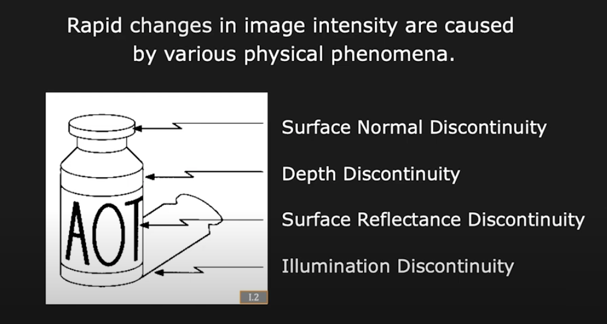
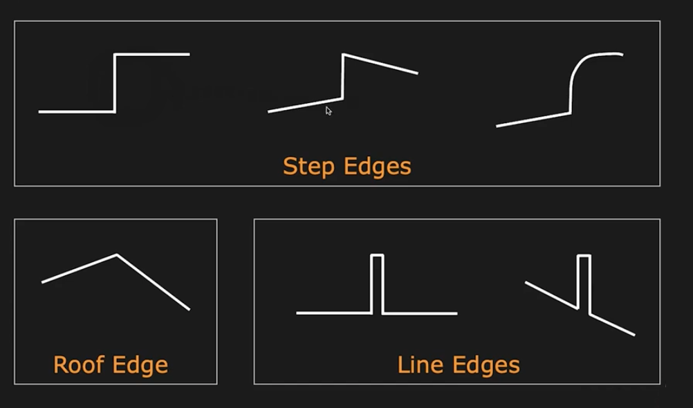
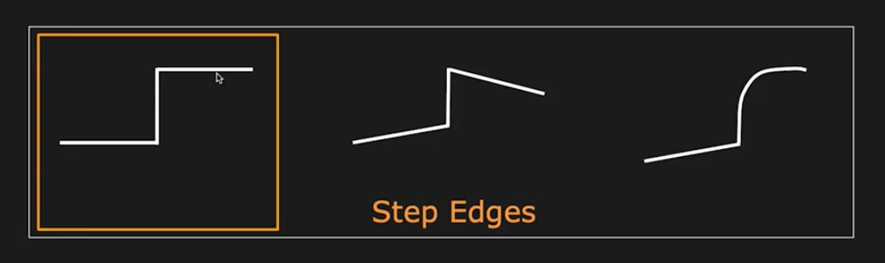

# First Principles of Computer Vison - Detection

## 1 Edge Detection

### 1.1 What is an Edge?

#### 1.1.1 What is an Edge?

Loosely speaking, we can say that an edge is a rapid change in image intensity within a small window in the image.

Here's an example from V.Nalwa's book. On the left, you see a photograph of a sculpture by Henry Moore --- a famous sculpture, on the right, you see a sketch of the sculpture, which is made by an artist.

You can see on the right that just with a few strokes, the artist is able to convey a lot of information about the sculpture --- the 3D structure of the sculpture, some of the lighting effects like shading and highligts, and so on.

So this is just to convey the point that edges, where you have rapid changes in brightness are extremely important in terms of conveying or capturing visual information.

#### 1.1.2 Causes of Edges

What are the physical phenomena in the real world that end up causing edges in images?

How do these edges actually manifect in terms of intensity profiles in the image?

#### 1.1.3 Types of Edges

For our purposes, we have to pin down a model for the edge so that we can use this to then develop a theroy of edge detection. So we are going to take the simplest of these models and use the step function shown here --- the step edge.

Now, it would be nice if edges appeared in images like this very clean step function shown here -- that would make the problem of edge detection a lot easier.

#### 1.1.4 Real Edges

Unfortunately for us, they tend to look like this, because images are noisy.

ANd then there's the sampling that take place in the image, there's also quantization, and other effects. So edges can actually look quite a bit different from the ideal step function, but we need to be able to still robustly detect them.

#### 1.1.5 Edge Detector

**We want an Edge Operator that produces:**

- **Edge Position**
- **Edge Magnitude (Strength)**
- **Edge Oientation (Direction)**

## 2 Boundary Detection

## 3 SIFT Detector
